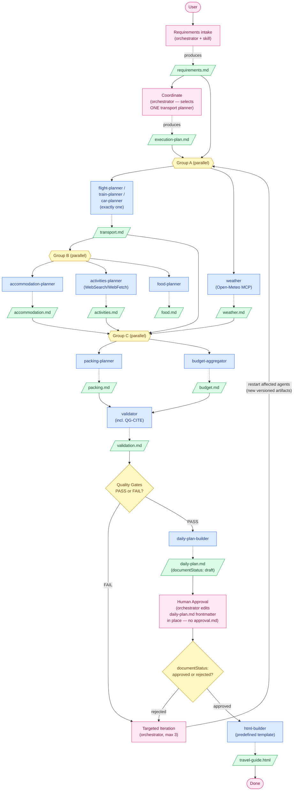

# AI Travel Planner - Workflow Requirements

## Objective

Build a multi-agent workflow that generates a personalized travel plan and produces a standalone HTML travel guide.

The workflow should demonstrate:

- human-in-the-loop interactions
- coordinator-based orchestration
- sequential and parallel execution
- artifact-based communication
- dynamic planning (including dynamic sub-agent selection)
- validation and quality gates
- targeted iterations
- human approval before final output

This is a concrete implementation of the model-driven, hub-and-spoke
architecture described in the parent assignment brief: the
**coordinator/orchestrator** — the `/plan-trip` main loop — is the hub,
planning/validation/output sub-agents are the spokes, and sub-agents are
selected dynamically per request rather than always run as a fixed list. The
coordinator's decisions are persisted as artifacts (`execution-plan.md`,
`iteration-plan-vN.md`) that sub-agents, the validator, and the resume path
consume. The clearest dynamic-selection point: exactly **one** of three
mode-specific transport planners (`flight-planner`, `train-planner`,
`car-planner`) runs per trip, chosen by the coordinator from the confirmed
transport mode.

## General Workflow Requirements

- The workflow must use external information sources — live web search
  (`WebSearch`/`WebFetch`) for accommodation/activities/food, plus the
  **Open-Meteo MCP** (weather) — when producing travel content, and must not
  rely solely on the model's internal knowledge, since prices, availability,
  and travel conditions change over time.
- **Citations are mandatory.** Every recommendation in every content artifact
  must carry a real markdown link to its source page: an accommodation entry
  links to the actual listing/hotel page, an activity to its official or
  review-site page, a restaurant to its page, a transport leg to the
  operator/booking page. A recommendation without a resolvable `http(s)://`
  link fails validation (gate `QG-CITE`). The only sanctioned exceptions:
  `budget.md` cites the source _artifacts_ its numbers came from, and
  `packing.md` cites its weather/entry-requirement sources in a `## Sources`
  section.
- **Artifacts have strict formats.** Every sub-agent's definition embeds the
  exact output template for its artifact — required headers verbatim and
  required table columns (including the `Link` column). An artifact that
  deviates from its template is rejected by the structural check before any
  downstream step consumes it.
- Common workflow capabilities (artifact template validation, HTML theming)
  must be implemented as reusable skills usable across multiple steps, not
  duplicated per agent. Requirements intake is a dedicated sub-agent
  (`requirements-formalizer`) rather than a skill, since it owns its own
  artifact (`requirements.md`), like every other content sub-agent.
- The final result must remain substantively consistent across repeated runs
  with the same confirmed input (same destinations, same budget envelope,
  same document structure), even though exact wording/content from live
  sources may vary. The HTML guide's structural consistency is guaranteed by
  a **predefined HTML template** that the builder fills in — never a page
  designed from scratch per run.

---

# Core Principles

## One Agent = One Responsibility = One Artifact

Every agent has a single responsibility.

Every agent produces exactly one primary artifact. (The three transport
planners share one artifact _type_ — `transport.md` — because only one of
them ever runs per trip.)

Agents never directly modify another agent's artifact.

If an artifact must be updated, a new version is created.

Example:

```text
transport.md
transport-v2.md
transport-v3.md
```

---

# Requirements

## Definition of Done

- The coordinator produces a different execution plan for at least two different requests (planning is dynamic, not hardcoded) — including selecting a different transport planner for different transport modes.
- At least one workflow step runs in parallel and at least one runs sequentially.
- At least one validation failure occurs and triggers a targeted retry of only the responsible sub-agent(s), never the whole workflow.
- Human approval exists as an explicit recorded artifact/state and is checked before final output generation; missing or invalid approval blocks final output.
- Workflow state is persisted to disk and supports resuming from the last completed step after the process is killed and restarted, without redoing finished work.
- `CLAUDE.md` exists in the repo and documents the workflow and how to run/resume it.
- At least 5 sub-agents and 1 coordinator are implemented (here: 13 sub-agents;
  the coordinator is the `/plan-trip` orchestrator itself, per the parent
  assignment brief — "the slash command instantiates the coordinator").
- At least 2 reusable skills are implemented.
- At least one `PreToolUse` hook and one `PostToolUse` hook are implemented and trigger on real workflow events.
- At least one community or custom MCP server is installed and used at the project level.
- Every recommendation in the stored sample-run artifacts carries a source link (see Citations Rule).
- `README.md` exists and explains how to use the workflow, with examples.
- At least 3 workflow runs — each with its sample input, generated artifacts,
  and persisted execution state — are stored in the repository (e.g. under
  `trips/<run-name>/`) to demonstrate the workflow handling different
  scenarios.
- The workflow can be set up and run from a clean repository checkout using
  only the instructions documented in `README.md`.

## Coordinator Requirements

The coordinator role is played by the **orchestrator** — the `/plan-trip` main
loop — not a separate sub-agent. Its decisions must still be persisted as
on-disk artifacts (`execution-plan.md`, `iteration-plan-vN.md`) so sub-agents,
the validator, and the resume path can consume them.

- Build an execution plan (agents required, parallel vs. sequential grouping, quality gates) tailored to the specific request, not a fixed list run every time.
- Select exactly **one** transport planner (`flight-planner` / `train-planner` / `car-planner`) from the confirmed transport mode.
- Route to a subset of sub-agents at runtime rather than always running all of them.
- Always include the mandatory citation gate `QG-CITE` among the quality gates.
- On a failed quality gate, map the failure to the minimal set of sub-agents to re-run (plus any downstream artifacts a rerun invalidates).
- Produce no travel content itself.

## Sub-agent Requirements

- At least 5 sub-agents, each with a single responsibility and exactly one artifact type as output.
- Each sub-agent's definition embeds the **strict output format** of its artifact: required section headers verbatim and required table columns, including the mandatory `Link` column on recommendation tables.
- No sub-agent modifies another agent's artifact; a re-run produces a new artifact version (e.g. `transport-v2.md`).
- A validation step, separate from the sub-agents it checks, evaluates artifacts against at least 2 named quality gates and reports pass/fail with findings.
- Each step's output is validated before the next step consumes it, so errors are caught early and do not cascade.

## Skills Requirements

- At least 2 reusable skills, each representing a capability usable across multiple steps rather than a sub-agent's job renamed as a skill. This implementation ships two:
  - `artifact-validator` — structural template check for any artifact: required sections, no placeholders, **citation coverage**, cross-references resolve (used after every group, before validation, before the daily plan, before HTML).
  - `trip-html-theme-builder` — reusable HTML rendering rules + the predefined `assets/template.html` the HTML builder fills in (used at Stage 8, and by any future artifact-to-HTML step).

## Hooks Requirements

- `PreToolUse` hooks that enforce workflow rules: an approval gate blocking
  `travel-guide.html` unless the latest `daily-plan(-vN).md` records
  `documentStatus: approved`; and a no-leak gate blocking `travel-guide.html`
  if its content names any internal workflow artifact.
- A `PostToolUse` hook that reacts to a real workflow event (updates `workflow-state.json` whenever a tracked artifact is written).
- All hooks trigger on real workflow events, not simulated ones.

## Human-in-the-Loop Requirements

- Approval is a recorded state — `documentStatus: approved` in the frontmatter
  of the daily plan itself (no separate approval artifact) — checked
  deterministically by the final step — never inferred from an agent's interpretation of the conversation.
- Missing, stale, or rejected approval blocks final output generation and routes back to targeted iteration, not a full restart.

## Workflow State, Resume & Error Handling Requirements

- Workflow state is persisted to disk (not only in conversation memory).
- At any time, the persisted state must allow determining: which steps are pending, in progress, completed, or failed; which artifacts exist and which passed validation; and what the next step is.
- Restarting Claude Code mid-workflow resumes from the persisted state without redoing completed steps (continuation).
- Pipeline errors (a failed agent, a failed quality gate, an exhausted retry limit) are handled explicitly: failures are recorded in the workflow state, a stated retry limit applies (default 3 if the domain doesn't dictate otherwise), and the workflow stops and reports the unresolved failure rather than silently proceeding once that limit is reached.

## MCP Requirements

- At least one community or custom MCP server is installed and configured at the project level. This implementation uses, in a real workflow step:
  - **Open-Meteo** ([cmer81/open-meteo-mcp](https://github.com/cmer81/open-meteo-mcp)) — weather source, called exclusively by `weather`, which writes its per-stop outlook to `weather.md`. No API key. (project-level MCP, `.mcp.json`) `packing-planner` and `daily-plan-builder` consume `weather.md` as an input artifact and never call the weather API themselves.
    `accommodation-planner`, `activities-planner`, and `food-planner` source real listings/attractions/restaurants via `WebSearch`/`WebFetch` rather than an MCP server. `html-builder` finds the guide's hero and background photos the same way (WebSearch, Wikimedia Commons preferred), then downloads and embeds them — no image-generation plugin is used.

## Documentation Requirements

- `CLAUDE.md` documents the workflow architecture and how to run/resume it.
- `README.md` explains setup and how to run the workflow, including usage examples and required environment configuration (Node.js, no API keys required).

## Quality Gates Requirements

- Quality gates are explicit, named, and checkable (not subjective judgments).
- `QG-CITE` (citation coverage) is mandatory in every execution plan.
- Every planning artifact set is validated against the applicable quality gates before the daily plan is produced.
- A failing gate identifies which artifact(s)/sub-agent(s) are responsible, enabling targeted (not full-pipeline) iteration.

---

# Workflow

## Stage 1 — Requirements Collection

### Role

Split across two actors, because sub-agents cannot ask the user questions
(`AskUserQuestion` is a main-loop-only tool):

- **Orchestrator** (the `/plan-trip` main loop) — analyzes the user's
  request, identifies missing information against the intake checklist, and
  asks follow-up questions when required (batched, ≤4 per round).
- **`requirements-formalizer`** sub-agent — formalizes the request + the
  orchestrator's Q&A transcript into the structured artifact.

### Responsibilities

- Analyze the user's request (orchestrator).
- Identify missing information against the intake checklist (orchestrator).
- Ask follow-up questions when required, batched ≤4 per round (orchestrator).
- Formalize the request + answers into the four-section artifact
  (`requirements-formalizer`).
- Never invent missing requirements — unanswered items become explicit
  assumptions (`requirements-formalizer`).
- Confirm the **transport mode** (flight / train / car): it drives planner
  selection (`requirements-formalizer`).
- Re-parse the written artifact to confirm all sections and checklist fields
  are present (`requirements-formalizer`).

Examples of clarification questions:

- Destination? Origin?
- Number of travel days? Dates?
- Budget?
- Number of travelers? Children?
- Transportation preference (flight / train / car)?
- Maximum daily travel time?
- Hotel preferences?
- Activity preferences?
- Accessibility requirements?
- Dietary constraints?

### Output

```text
requirements.md
```

Strict format: `## Confirmed`, `## Optional Preferences`, `## Constraints`,
`## Assumptions (explicit)`.

---

## Stage 2 — Workflow Planning

### Role

Coordinator — executed by the **orchestrator** (the `/plan-trip` main loop),
which builds the execution strategy (agents, groups, quality gates) from the
requirements.

### Input

```text
requirements.md
```

### Responsibilities

- Analyze requirements.
- Select exactly **one** transport planner from the confirmed mode.
- Determine which other planning agents are required, from: `weather`,
  `accommodation-planner`, `activities-planner`, `food-planner`,
  `packing-planner`, `budget-aggregator` (`validator`, `daily-plan-builder`,
  and `html-builder` always run).
- Define execution dependencies and parallel execution groups.
- Build Quality Gates (always including budget, daily travel time, no
  duplicate attractions, transport-mode match, and `QG-CITE`).
- Define the iteration strategy (gate → minimal agent set).

The Coordinator **does not generate travel content**.

### Output

```text
execution-plan.md
```

Strict format: `## Agents Required`, `## Execution Groups`, `## Quality Gates`,
`## Iteration Strategy`.

---

## Stage 3 — Parallel Planning

The orchestrator launches each group's agents **in parallel**, per the
execution plan. Each agent receives `requirements.md`, `execution-plan.md`,
and the latest versions of its input artifacts. After each group, the
`artifact-validator` skill structurally checks every new artifact (sections,
placeholders, **citation coverage**) before the next group runs.

Typical grouping:

- **Group A** (parallel, no deps beyond `requirements.md`): `<mode>-planner`,
  `weather`
- **Group B** (parallel, needs `transport.md` → `## Stops & Nights`):
  `accommodation-planner`, `activities-planner`, `food-planner`
- **Group C** (parallel, needs Groups A+B): `packing-planner` (reads
  `weather.md`, `activities.md`, `accommodation.md`, and — for a car trip —
  `transport.md`, so it always runs after those artifacts exist, never
  alongside them), `budget-aggregator`

If the destination itself is still open (the traveler wants suggestions, not
yet narrowed to one place), `weather` and `packing-planner` are
deferred out of the current groups until a later requirements revision
confirms a destination.

### Transport Planner (`flight-planner` | `train-planner` | `car-planner`)

Only the one matching the confirmed mode runs. All three produce the same
artifact type so downstream agents need no per-mode logic. This artifact also
owns the trip's stop/route structure (there is no separate route artifact).

Output: `transport.md` — strict format:

```text
# Transport Plan — <Flight|Train|Car>
## Mode
## Stops & Nights        | Order | Stop | Nights | Purpose |
## Legs                  | # | From → To | Day/Date | Detail | Duration | Est. Cost | Link |
## Local Transport       | Stop | Option | Est. Cost | Link |
## Estimated Transport Total
## Rationale & Assumptions
```

### Weather Planner

Sole caller of the **Open-Meteo MCP** (geocoding + forecast/seasonal/archive,
chosen by how far out the trip is). Needs only `requirements.md`, so it runs
in the first execution group alongside the transport planner.

Output: `weather.md` — strict format, one subsection per stop:

```text
# Weather Outlook
## <Stop name>          Method: forecast | seasonal | archive; temperature
                        range, precipitation, and what it implies for
                        clothing/activities.
## Assumptions
```

Citation exception: cites the Open-Meteo method used per stop, not a listing
link. Consumed by `packing-planner` and `daily-plan-builder`, neither of which
has weather tools or re-fetches it.

### Accommodation Planner

Output: `accommodation.md` — strict format:

```text
# Accommodation
## Accommodations        | Stop | Property | Stars | Key Features | Cost/night × Nights | Subtotal | Link |
## Estimated Accommodation Total
## Rationale & Assumptions
```

`Link` = the actual listing/hotel page.

### Activities Planner

Primary source: live **WebSearch**/`WebFetch`; links are the attraction's
official page or a review-site page.

Output: `activities.md` — strict format:

```text
# Activities
## Activities by Day/Stop
### Day <N> — <Stop>     | Activity | Type | Duration | Est. Cost | Suitability | Link |
## Estimated Activities Total
## Rationale & Assumptions
```

Rules: every day ≥1 meaningful activity; no duplicate attractions.

### Food Planner

Output: `food.md` — strict format:

```text
# Food
## Restaurants by Stop   | Stop | Restaurant | Cuisine | Price Range | Dietary Fit | Link |
## Local Food to Try     | Specialty | Where | Notes | Link |
## Estimated Food Cost
## Rationale & Assumptions
```

### Packing Planner

Reads the weather outlook from `weather.md` (written by `weather`) —
has no weather tools and never calls the Open-Meteo MCP itself.

Output: `packing.md` — strict format:

```text
# Packing
## Weather Outlook
## Clothing
## Electronics
## Travel Documents
## Medicines & Health
## Destination-Specific
## Sources
```

### Budget Aggregator

Invents no numbers; every figure comes from the input artifacts.

Output: `budget.md` — strict format:

```text
# Budget
## Budget Breakdown      | Category | Cost | Source Artifact |
## Estimated Total
## Against Limit
## Assumptions
```

---

## Stage 4 — Validation

### Agent

`validator`

### Inputs

All planning artifacts (latest versions, including `weather.md`) +
`execution-plan.md` (the gates) + `requirements.md`.

### Responsibilities

Validate the complete travel plan against every named quality gate with
explicit evidence — including `QG-CITE` (every recommendation row has a real
`http(s)://` link), budget, travel time, duplicated attractions, transport-mode
match, logical consistency, requirement compliance, missing information,
accommodation quality, itinerary completeness.

### Output

```text
validation.md
```

Strict format: first line `# Validation Result: PASS` or
`# Validation Result: FAIL`, then `## Gate Results`
(`| QG# | Gate | Result | Evidence |`) and `## Findings`.

---

## Stage 5 — Targeted Iteration

### Role

Coordinator — executed by the **orchestrator** (the `/plan-trip` main loop),
which maps failures to reruns itself.

### Input

```text
validation.md
```

### Responsibilities

Analyze validation failures. Restart only the affected planning agents (plus
downstream agents whose inputs the rerun invalidates).

Examples:

- Budget exceeded → rerun `budget-aggregator` + `accommodation-planner`
- Travel time exceeded → rerun `<mode>-planner` + `activities-planner`
- `QG-CITE` failed → rerun only the agent(s) with uncited rows

Each rerun produces a new version of its artifact
(`transport-v2.md`, `budget-v2.md`). Validation runs again. The iteration
continues until all gates pass or the retry limit (3) is reached — then the
workflow stops and reports the unresolved failure.

Output: `iteration-plan-vN.md` — strict format: `## Failed Gates`,
`## Agents To Rerun`, `## Guidance Per Agent`.

---

## Stage 6 — Daily Plan Generation

### Agent

`daily-plan-builder`

### Inputs

Latest validated planning artifacts.

### Responsibilities

Merge all planning artifacts into a single day-by-day travel plan that is easy
for a human to review. **No new travel content**; every source link is
preserved. Sole enrichment: per-day weather lines read from `weather.md`
(never re-fetched from the MCP).

### Output

```text
daily-plan.md
```

Strict format: `# <Trip Title>`, `## Trip Summary`, `## Day-by-Day Itinerary`
(`### Day <N> — <date> — <location>` blocks), `## Where You're Staying`,
`## Getting There & Around`, `## Budget Summary`, `## Packing Checklist`,
`## Travel Tips`.

Opens with a frontmatter block carrying the workflow's **only** tracked
document property:

```yaml
---
documentStatus: draft
---
```

`draft` is the default working state; the orchestrator flips it to `approved`
or `rejected` (with a `reason:` line) after human review in Stage 7. No other
artifact in the workflow carries frontmatter.

---

## Stage 7 — Human Approval

### Role

Executed by the **orchestrator** (human-in-the-loop).

### Input

```text
daily-plan.md
```

### Responsibilities

Present the daily plan for approval. Outcomes: `APPROVED` or
`CHANGES_REQUESTED`.

### Output

There is no separate approval artifact — approval is a property of the daily
plan itself. The orchestrator `Edit`s the latest `daily-plan(-vN).md`
frontmatter in place:

- **APPROVED** → `documentStatus: draft` flips to `documentStatus: approved`
  (optionally with an `approvalNotes:` line).
- **CHANGES_REQUESTED** → flips to `documentStatus: rejected` with a
  `reason:` line capturing the traveler's rejection reason in their own
  words. The orchestrator then re-dispatches `requirements-formalizer` with
  the feedback and the latest `requirements.md`, producing a new version
  (`requirements-v2.md`) as a structured change note, and starts another
  targeted iteration (Stage 5) that regenerates a new daily-plan version
  (`daily-plan-v2.md`, `documentStatus: draft`) — never a full restart, and
  never an edit of the now-frozen rejected version.

The `PostToolUse` hook records the resulting status in `workflow-state.json`
on each write.

---

## Stage 8 — HTML Generation

### Agent

`html-builder`

### Inputs

```text
daily-plan.md   (or the latest daily-plan-vN.md, documentStatus: approved)
.claude/skills/trip-html-theme-builder/SKILL.md
.claude/skills/trip-html-theme-builder/assets/template.html
```

### Responsibilities

Generate a standalone HTML travel guide by **filling the predefined template**
from the `trip-html-theme-builder` skill — never designing a page from
scratch. Per-trip customization is limited to the theme tokens (accent colors,
hero emoji, title). The HTML Builder must **not generate new travel content**
and must preserve every citation link as an anchor. A `PreToolUse` approval
gate hook blocks the write unless the latest `daily-plan(-vN).md` records
`documentStatus: approved`; a second `PreToolUse` no-leak hook blocks the
write if the rendered HTML names any internal workflow artifact.

### Output

```text
travel-guide.html
```

---

# Quality Gates

Examples (defined per-run by the coordinator; the first five are always present):

- Budget does not exceed user limit.
- Daily travel time respects user constraints.
- No duplicate attractions.
- Transportation matches the confirmed mode.
- **QG-CITE**: every recommendation carries a real source link.
- All mandatory requirements are satisfied.
- Every day contains meaningful activities.
- Accommodation matches user preferences.
- No unresolved placeholders remain.

---

# Artifact Flow

```text
requirements.md
        │
        ▼
execution-plan.md
        │
        ▼
transport.md   (one of: flight-planner | train-planner | car-planner)
weather.md
        │
        ▼
accommodation.md
activities.md
food.md
        │
        ▼
packing.md
budget.md
        │
        ▼
validation.md
        │
        ▼
(updated -vN artifacts if necessary)
        │
        ▼
daily-plan.md   (documentStatus: draft → approved/rejected, in place)
        │
        ▼
travel-guide.html
```

---

# Workflow Diagram

```text
User
 │
 ▼
Requirements intake (orchestrator asks + requirements-formalizer formalizes)
 │
 ▼
requirements.md
 │
 ▼
Coordinate (orchestrator; selects ONE transport planner + agent set)
 │
 ▼
execution-plan.md
 │
 ▼
Group A (parallel): <mode>-planner, weather
 │
 ▼
Group B (parallel): accommodation-planner, activities-planner, food-planner
 │
 ▼
Group C (parallel): packing-planner, budget-aggregator
 │
 ▼
Validator
 │
 ├────────────── FAIL ──────────────┐
 │                                  │
 │                     Targeted Iteration (orchestrator,
 │                     max 3; reruns minimal agent set)
 │                                  │
 └──────────── PASS ◄───────────────┘
 │
 ▼
Daily Plan Builder
 │
 ▼
daily-plan.md
 │
 ▼
Human Approval (orchestrator; flips daily-plan.md's
documentStatus frontmatter in place — no separate approval.md)
 │
 ├──── CHANGES REQUESTED (documentStatus: rejected) ────┐
 │                                                       │
 │                     Targeted Iteration (orchestrator)
 │                                                       │
 └──────── APPROVED (documentStatus: approved) ◄─────────┘
 │
 ▼
HTML Builder (fills predefined template; hook-gated on documentStatus: approved)
 │
 ▼
travel-guide.html
```

---

# Mermaid Diagram



---
