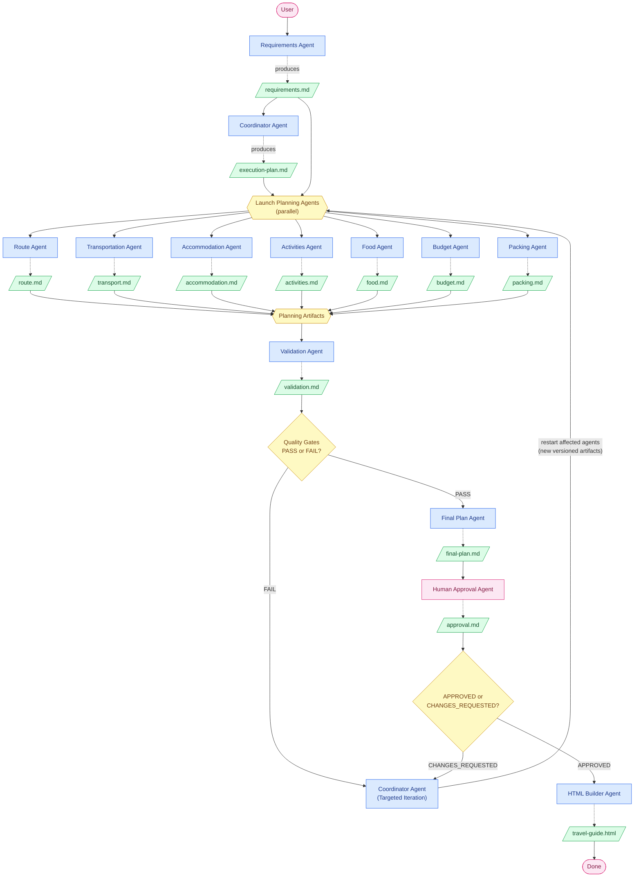

# AI Travel Planner - Workflow Requirements

## Objective

Build a multi-agent workflow that generates a personalized travel plan and produces a standalone HTML travel guide.

The workflow should demonstrate:

- human-in-the-loop interactions
- coordinator-based orchestration
- sequential and parallel execution
- artifact-based communication
- dynamic planning
- validation and quality gates
- targeted iterations
- human approval before final output

This is a concrete implementation of the model-driven, hub-and-spoke
architecture described in the parent assignment brief (`idea.md`): the
`travel-coordinator` is the hub, planning/validation/output sub-agents are
the spokes, and sub-agents are selected dynamically per request rather than
always run as a fixed list.

## General Workflow Requirements

- The workflow must use external information sources (live web search) when
  producing travel content (routes, accommodation, activities, food,
  transport, packing) and must not rely solely on the model's internal
  knowledge, since prices, availability, and travel conditions change over
  time.
- Common workflow capabilities (e.g. requirements interviewing, artifact
  template validation, workflow-state read/update) must be implemented as
  reusable skills usable across multiple steps, not duplicated per agent.
- The final result must remain substantively consistent across repeated
  runs with the same confirmed input (same destinations, same budget
  envelope, same structure), even though exact wording/content from live
  web search may vary.

---

# Core Principles

## One Agent = One Responsibility = One Artifact

Every agent has a single responsibility.

Every agent produces exactly one primary artifact.

Agents never directly modify another agent's artifact.

If an artifact must be updated, a new version should be created.

Example:

```text
route.md
route-v2.md
route-v3.md
```

---

# Requirements

## Definition of Done

- The coordinator produces a different execution plan for at least two different requests (planning is dynamic, not hardcoded).
- At least one workflow step runs in parallel and at least one runs sequentially.
- At least one validation failure occurs and triggers a targeted retry of only the responsible sub-agent(s), never the whole workflow.
- Human approval exists as an explicit recorded artifact/state and is checked before final output generation; missing or invalid approval blocks final output.
- Workflow state is persisted to disk and supports resuming from the last completed step after the process is killed and restarted, without redoing finished work.
- `CLAUDE.md` exists in the repo and documents the workflow and how to run/resume it.
- At least 5 sub-agents and 1 coordinator are implemented.
- At least 2 reusable skills are implemented.
- At least one `PreToolUse` hook and one `PostToolUse` hook are implemented and trigger on real workflow events.
- At least one community or custom MCP server is installed and used at the project level.
- `README.md` exists and explains how to use the workflow, with examples.
- At least 3 workflow runs — each with its sample input, generated artifacts,
  and persisted execution state — are stored in the repository (e.g. under
  `trips/<run-name>/`) to demonstrate the workflow handling different
  scenarios.
- The workflow can be set up and run from a clean repository checkout using
  only the instructions documented in `README.md`.

## Coordinator Requirements

- Build an execution plan (agents required, parallel vs. sequential grouping, quality gates) tailored to the specific request, not a fixed list run every time.
- Route to a subset of sub-agents at runtime rather than always running all of them.
- On a failed quality gate, map the failure to the minimal set of sub-agents to re-run.
- Produce no travel content itself.

## Sub-agent Requirements

- At least 5 sub-agents, each with a single responsibility and exactly one artifact type as output.
- No sub-agent modifies another agent's artifact; a re-run produces a new artifact version (e.g. `route-v2.md`).
- A validation step, separate from the sub-agents it checks, evaluates artifacts against at least 2 named quality gates and reports pass/fail with findings.
- Each step's output is validated before the next step consumes it, so errors are caught early and do not cascade.

## Skills Requirements

- At least 2 reusable skills, each representing a capability usable across multiple steps (e.g. running a clarification interview, validating an artifact against a template, reading/updating workflow state) rather than a sub-agent's job renamed as a skill.

## Hooks Requirements

- A `PreToolUse` hook that enforces a workflow rule (e.g. blocks edits to an artifact that already passed validation/approval).
- A `PostToolUse` hook that reacts to a real workflow event (e.g. updates persistent state when an artifact is written, or surfaces the final artifact once generated).
- Both hooks trigger on real workflow events, not simulated ones.

## Human-in-the-Loop Requirements

- Approval is a recorded state/artifact (e.g. `status: APPROVED`) checked deterministically by the final step — never inferred from an agent's interpretation of the conversation.
- Missing, stale, or rejected approval blocks final output generation and routes back to targeted iteration, not a full restart.

## Workflow State, Resume & Error Handling Requirements

- Workflow state is persisted to disk (not only in conversation memory).
- At any time, the persisted state must allow determining: which steps are pending, in progress, completed, or failed; which artifacts exist and which passed validation; and what the next step is.
- Restarting Claude Code mid-workflow resumes from the persisted state without redoing completed steps (continuation).
- Pipeline errors (a failed agent, a failed quality gate, an exhausted retry limit) are handled explicitly: failures are recorded in the workflow state, a stated retry limit applies (default 3 if the domain doesn't dictate otherwise), and the workflow stops and reports the unresolved failure rather than silently proceeding once that limit is reached.

## MCP Requirements

- At least one community or custom MCP server is installed and configured at the project level.
- The workflow makes real use of that MCP server as part of one or more steps.

## Documentation Requirements

- `CLAUDE.md` documents the workflow architecture and how to run/resume it.
- `README.md` explains setup and how to run the workflow, including usage examples.

## Quality Gates Requirements

- Quality gates are explicit, named, and checkable (not subjective judgments).
- Every planning artifact set is validated against the applicable quality gates before the final plan is produced.
- A failing gate identifies which artifact(s)/sub-agent(s) are responsible, enabling targeted (not full-pipeline) iteration.

---

# Workflow

## Stage 1 — Requirements Collection

### Agent

Requirements Agent

### Responsibilities

- Analyze the user's request.
- Identify missing information.
- Ask follow-up questions when required.
- Never invent missing requirements.
- Collect both mandatory and optional requirements.

Examples of clarification questions:

- Destination?
- Number of travel days?
- Budget?
- Number of travelers?
- Children?
- Transportation preference?
- Maximum driving time?
- Hotel preferences?
- Activity preferences?
- Accessibility requirements?

### Output

```text
requirements.md
```

Contents:

- confirmed requirements
- optional preferences
- user constraints
- assumptions (explicitly marked)

---

## Stage 2 — Workflow Planning

### Agent

Coordinator Agent

### Input

```text
requirements.md
```

### Responsibilities

- Analyze requirements.
- Build the execution strategy.
- Determine which planning agents are required.
- Define execution dependencies.
- Define parallel execution groups.
- Build Quality Gates.
- Define iteration strategy.

The Coordinator **does not generate travel content**.

### Output

```text
execution-plan.md
```

---

## Stage 3 — Parallel Planning

The Coordinator launches planning agents in parallel.

Each agent receives:

- requirements.md
- execution-plan.md

---

### Route Agent

Output

```text
route.md
```

Contains

- cities
- travel order
- travel durations
- route rationale

---

### Transportation Agent

Output

```text
transport.md
```

Contains

- transportation recommendations
- transfers
- local transportation

---

### Accommodation Agent

Output

```text
accommodation.md
```

Contains

- accommodation recommendations
- estimated costs
- selection rationale

---

### Activities Agent

Output

```text
activities.md
```

Contains

- attractions
- activities
- estimated duration
- family suitability

---

### Food Agent

Output

```text
food.md
```

Contains

- restaurant recommendations
- local food suggestions

---

### Budget Agent

Output

```text
budget.md
```

Contains

- accommodation cost
- transportation cost
- food cost
- activity cost
- estimated total

---

### Packing Agent

Output

```text
packing.md
```

Contains

- clothing
- electronics
- travel documents
- medicines
- destination-specific recommendations

---

## Stage 4 — Validation

### Agent

Validation Agent

### Inputs

All planning artifacts.

### Responsibilities

Validate the complete travel plan.

Checks include:

- budget
- travel time
- duplicated attractions
- logical consistency
- requirement compliance
- missing information
- accommodation quality
- itinerary completeness

### Output

```text
validation.md
```

Possible status

PASS

or

FAIL

with detailed findings.

---

## Stage 5 — Targeted Iteration

### Agent

Coordinator Agent

### Input

```text
validation.md
```

### Responsibilities

Analyze validation failures.

Restart only affected planning agents.

Examples

Budget exceeded

↓

Restart

- Budget Agent
- Accommodation Agent

Travel time exceeded

↓

Restart

- Route Agent
- Transportation Agent
- Activities Agent

Each rerun produces a new version of its artifact.

Example

```text
route-v2.md
budget-v2.md
```

Validation is executed again.

The iteration continues until:

```text
All Quality Gates Passed
```

---

## Stage 6 — Final Plan Generation

### Agent

Final Plan Agent

### Inputs

Latest approved planning artifacts.

### Responsibilities

Merge all planning artifacts into a single travel plan.

The Final Plan should be easy for a human to review.

### Output

```text
final-plan.md
```

Contains

- trip summary
- itinerary
- accommodation summary
- transportation summary
- activity schedule
- restaurant recommendations
- budget summary
- packing checklist
- travel tips

---

## Stage 7 — Human Approval

### Agent

Human Approval Agent

### Input

```text
final-plan.md
```

### Responsibilities

Present the final plan for approval.

Possible outcomes

APPROVED

or

CHANGES_REQUESTED

### Output

```text
approval.md
```

If changes are requested, the Coordinator starts another targeted iteration.

---

## Stage 8 — HTML Generation

### Agent

HTML Builder Agent

### Inputs

```text
final-plan.md
approval.md
```

### Responsibilities

Generate a standalone HTML travel guide.

The HTML Builder must **not generate new travel content**.

It only transforms the approved plan into HTML.

### Output

```text
travel-guide.html
```

---

# Quality Gates

Examples

- Budget does not exceed user limit.
- Daily travel time respects user constraints.
- All mandatory requirements are satisfied.
- No duplicate attractions.
- Every day contains meaningful activities.
- Transportation matches user preferences.
- Accommodation matches user preferences.
- No unresolved placeholders remain.

---

# Artifact Flow

```text
requirements.md
        │
        ▼
execution-plan.md
        │
        ▼
route.md
transport.md
accommodation.md
activities.md
food.md
budget.md
packing.md
        │
        ▼
validation.md
        │
        ▼
(updated artifacts if necessary)
        │
        ▼
final-plan.md
        │
        ▼
approval.md
        │
        ▼
travel-guide.html
```

---

# Workflow Diagram

```text
User
 │
 ▼
Requirements Agent
 │
 ▼
requirements.md
 │
 ▼
Coordinator Agent
 │
 ▼
execution-plan.md
 │
 ▼
Parallel Planning Agents
 │
 ▼
Planning Artifacts
 │
 ▼
Validation Agent
 │
 ├────────────── FAIL ──────────────┐
 │                                  │
 │                          Coordinator Agent
 │                                  │
 │                          Targeted Iteration
 │                                  │
 └──────────── PASS ◄───────────────┘
 │
 ▼
Final Plan Agent
 │
 ▼
final-plan.md
 │
 ▼
Human Approval Agent
 │
 ├──── CHANGES REQUESTED ───────────┐
 │                                  │
 │                          Coordinator Agent
 │                                  │
 │                          Targeted Iteration
 │                                  │
 └──────── APPROVED ◄───────────────┘
 │
 ▼
HTML Builder Agent
 │
 ▼
travel-guide.html
```

---

# Mermaid Diagram



---
