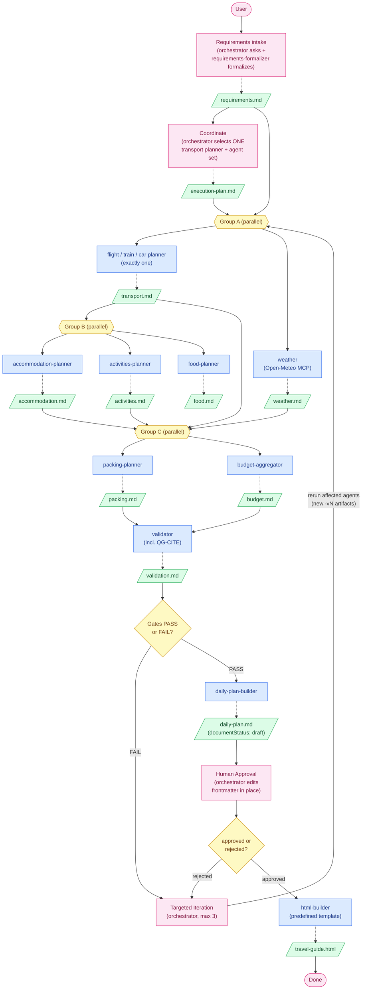

# AI Travel Planner — Workflow

A model-driven, **hub-and-spoke multi-agent workflow** that turns a free-text
travel request into a human-approved, standalone HTML travel guide. It runs as
the `/plan-trip` slash command.

- The **orchestrator** (the `/plan-trip` main loop) is the hub. It is the only
  actor that talks to the human, makes coordination decisions, and persists
  them as artifacts. It produces no travel content of its own.
- The **sub-agents** are the spokes. They run non-interactively and communicate
  only through artifact files on disk — no agent ever edits another's file.
- Sub-agents are selected **dynamically per request**, not run as a fixed list.
  The clearest example: exactly **one** of three transport planners
  (`flight-planner`, `train-planner`, `car-planner`) runs, chosen from the
  confirmed transport mode.

Re-running with a request that yields the same run slug (same destination +
month) **resumes** from `trips/<slug>/workflow-state.json` rather than
restarting.

## Core principles

- **One agent = one responsibility = one artifact.** The three transport
  planners share one artifact *type* (`transport.md`) because only one runs per
  trip.
- **Never overwrite; always version.** An updated artifact becomes a new
  version (`transport.md` → `transport-v2.md`). The `-vN` suffix is the only
  version marker — artifacts carry no `version` frontmatter.
- **Citations are mandatory (`QG-CITE`).** Every recommendation row links to a
  real `http(s)://` source page. Exceptions: `budget.md` cites source
  artifacts, `packing.md` cites in `## Sources`, `weather.md` cites the
  Open-Meteo method per stop.
- **Local currency everywhere.** Every cost is quoted in the trip currency (the
  destination country's local currency), resolved by `requirements-formalizer`.
- **Approval before HTML.** The guide is generated only after the daily plan
  records `documentStatus: approved` in its frontmatter — the workflow's only
  tracked document property (`draft` → `approved`/`rejected`). There is no
  separate approval artifact.
- **No internal-artifact leakage.** User-facing output (daily plan, HTML guide)
  never names an internal workflow file. Facts flow through; filenames do not.

## Sub-agents

| Agent | Responsibility | Artifact |
| --- | --- | --- |
| `requirements-formalizer` | Formalize the request + Q&A into structured requirements (incl. transport mode, trip currency) | `requirements.md` |
| `weather` | Per-stop weather outlook via the Open-Meteo MCP | `weather.md` |
| `flight-planner` / `train-planner` / `car-planner` | Transport for the chosen mode (exactly one runs) | `transport.md` |
| `accommodation-planner` | Hotels with linked listings, costs, rationale | `accommodation.md` |
| `activities-planner` | Attractions with duration, cost, suitability | `activities.md` |
| `food-planner` | Restaurants and local food, honoring dietary constraints | `food.md` |
| `packing-planner` | Packing checklist built from the weather outlook | `packing.md` |
| `budget-aggregator` | Categorized cost breakdown + total (invents no numbers) | `budget.md` |
| `validator` | Quality-gate check incl. `QG-CITE` → PASS/FAIL + findings | `validation.md` |
| `daily-plan-builder` | Merge latest artifacts into a day-by-day plan (no new content) | `daily-plan.md` |
| `html-builder` | Fill the predefined HTML template (no new content) | `travel-guide.html` |

Each agent's definition (`.claude/agents/`) embeds the strict format of its
artifact — required headers and table columns, including the mandatory `Link`
column on recommendation tables.

## Stages

1. **Requirements** — the orchestrator analyzes the request, asks clarifying
   questions (batched, ≤4 per round), then `requirements-formalizer` produces
   `requirements.md`. Unanswered items become explicit assumptions.
2. **Coordination** — the orchestrator selects the transport planner and the
   required agent set, defines parallel/sequential groups and quality gates
   (always including `QG-CITE`), and writes `execution-plan.md`.
3. **Parallel planning** — agents run in groups (below); the
   `artifact-validator` skill structurally checks each new artifact before the
   next group runs.
4. **Validation** — `validator` checks every artifact against the plan's gates
   and writes `validation.md` (PASS/FAIL + findings).
5. **Targeted iteration** — on FAIL, the orchestrator reruns only the affected
   agents (plus downstream artifacts a rerun invalidates), producing new
   versions. Repeats until PASS or the retry limit (3), then stops and reports.
6. **Daily plan** — `daily-plan-builder` merges the latest validated artifacts
   into `daily-plan.md` (`documentStatus: draft`).
7. **Human approval** — the orchestrator presents the plan and edits its
   frontmatter in place: `approved`, or `rejected` (with a `reason:`) which
   triggers a new targeted iteration — never a full restart.
8. **HTML generation** — `html-builder` fills the predefined template into
   `travel-guide.html`, hook-gated on `documentStatus: approved`.

Typical execution groups (Stage 3):

- **Group A** (needs `requirements.md`): `<mode>-planner`, `weather`
- **Group B** (needs `transport.md` stops): `accommodation-planner`,
  `activities-planner`, `food-planner`
- **Group C** (needs A + B): `packing-planner`, `budget-aggregator`

## Supporting components

- **Skills** (`.claude/skills/`, reusable across stages): `artifact-validator`
  (structural + citation check) and `trip-html-theme-builder` (rendering rules
  + the predefined `template.html`).
- **Hooks** (`.claude/hooks/`, one responsibility each): `approval-gate-guard`
  and `no-leak-guard` (PreToolUse, gate the HTML write) and `post-write-state`
  (PostToolUse, keeps `workflow-state.json` in sync).
- **MCP / sourcing**: `open-meteo` (no key) supplies weather, called only by
  `weather`. Content agents source real pages via `WebSearch`/`WebFetch`;
  `html-builder` sources and embeds images the same way.

## Flow

